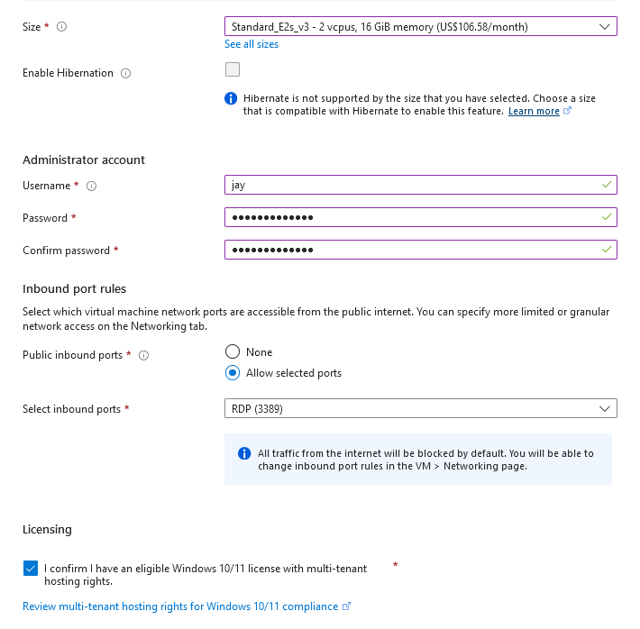

<h1>Network Security Groups (NSGs) and Inspecting Traffic Between Azure Virtual Machines</h1>
In this tutorial, we observe various network traffic to and from Azure Virtual Machines with Wireshark as well as experiment with Network Security Groups.  

<!--
<h2>Video Demonstration</h2>

- ### [YouTube: Azure Virtual Machines, Wireshark, and Network Security Groups](https://www.youtube.com)
-->

<h2>Environments and Technologies Used</h2>

- Microsoft Azure (Virtual Machines/Compute)
- Remote Desktop
- Various Command-Line Tools
- Various Network Protocols (SSH, RDH, DNS, HTTP/S, ICMP)
- Wireshark (Protocol Analyzer)

<h2>Operating Systems Used </h2>

- Windows 10 Pro (22H2)
- Ubuntu Server 24.04

<h2>High-Level Steps</h2>

1. Create a Windows 10 Pro and Ubuntu Server virtual machine under the same virtual network
2. Remote connect into the Windows virtual machine to install Wireshark
3. Execute various Windows networking commands and inspect packets in Wireshark

<h2>Actions and Observations</h2>

<h3>Step 1 - Virtual Machine Setup</h3>

With Azure, we can deploy a virtual machine to the cloud and connect to it via Remote Desktop Protocol. Let's deploy a Windows 10 Pro VM under a resource group, which we'll call `azure-networking`. For our case, 2 CPUs and 16 GB of RAM will be enough.

  
  <!--  -->

When creating the Ubuntu Server VM, we will use a password based authenication rather than an SSH key. The Ubuntu Server VM is not as resource heavy as the Windows VM, so we can opt to use one of the cheaper hardware sizes. To ensure connectivity between the two VMs, we can put this VM under the same virtual network.

  
  

<h3>Step 2 - Wireshark Installation</h3>

Now that the VMs are created, we can use **Remote Desktop Connection** to connect to our Windows 10 Pro VM. Once the Windows setup is complete, download [Wireshark](https://www.wireshark.org/download.html). We will download the `Windows x64 Installer` and stick with the default settings. Note that the Wireshark installer will also install `Npcap`. Now, open Wireshark and you will be greeted with the following screen:

<h3>Step 3 - Packet Trace</h3>

With Wireshark we can inspect all incoming and outgoing packets from our computer. We will inspect the following traffic:
- ICMP
- SSH
- DHCP
- DNS
- RDP

Notice that we can filter our packets. As I am using an Ethernet connection, I will select that for caputuring traffic.

<h4>ICMP Trace</h4>

Let's first filter by ICMP traffic by typing `icmp` into the filter text field at the top and hit apply.

Then we can start the packet trace by clicking the button on the top left.

We should then be greeted with the following screen:

At the moment, there are no packets to display as there isn't any ICMP traffic being sent or received by our machine. Luckily, the Windows OS has built-in commands that utilize the ICMP protocol for sending and receiving information. One of these commands is the `ping` command, which is used to test connectivity to another machine. Since we created an Ubuntu client under the same virtual network as our Windows client, we can ping its private IP address (in my case this is `10.0.0.5`). In command prompt, execute the following command:

`ping 10.0.0.5`

Of course, your IP address configuration may be different so be sure to find your Ubuntu client under `Virtual Machines` in the Azure portal. Now, if you see something like this from your ping result, it means the Ubuntu client was succesfully reached!

If we take a look at the Wireshark packet trace, we will notice some packet information.

<h4>SSH Trace</h4>

We can connect to our Ubuntu VM through ssh as follows:

`ssh <USERNAME>@<IP>`

Here, the username is what you used to create the Ubuntu VM and the IP address is its private IP. In my case, I connect to it via the command `ssh jay@10.0.0.5`. Then we authenticate with the password used during VM creation. After this is done, you will be presented with a linux command line, indicating we have connected to the Ubuntu server. In Wireshark we will see something like this:

The first couple lines indicate the packets exchanged during authentication. The authentication process uses elliptic curve Diffie-Hellman, a very cryptographically secure public key exchange algorithm that prevents unauthorized access from attackers.